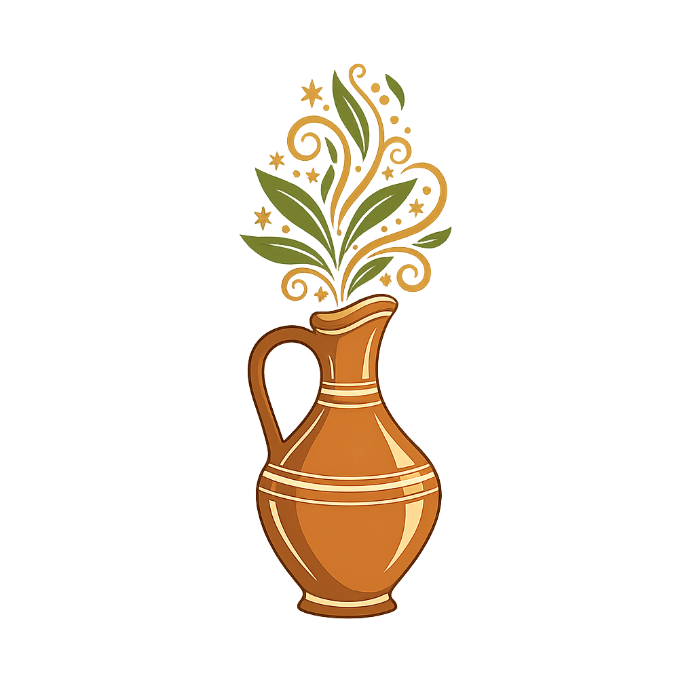

# Secret-de-Hammam



## Description projet

Texte

## Fonctionnalité

### 👩‍💻 Administrateur

Gestionn des produits via  dashboard : CRUD Complet
* Ajouter produits
* Modifier produit
* Supprimer produit

### 👩 Public 

* Formulaire de contact

### Utilisateur connecté

* Dashboard profil

### Language

* 

* 

* CSS
* Docker
* Node js
* Express
* Typescript
* Mysql
* Mongodb
* figma

### Installation

Prérequis: 
> Installer docker: [Docker](https://www.docker.com/)

Créer le conteneur docker

```bash
docker compose -up
```

```html
<p> Coucou </p>
```

```typescript
console.log("coucou")
```

### Procedure d'acces 

npm run dev / npm run server

### Procedure de test

npm run test / npm run test : coverage

### Shéma Merise

### Point d'acces api REST (endpoints)
tableau ==> tels route est accessible par 

Methode HTTP       | Route          | Description
---------------------------------------------------------------------
POST   User        | /api/register  | Enregistrer un utilisateur
---------------------------------------------------------------------
Post   User        | /api/login     | Connecter un utilisateur
--------------------------------------------------------------------- 

### Telecharger document

[Mon projet de certification pdf](Docs_projet/mon_projet_certification2.pdf)


